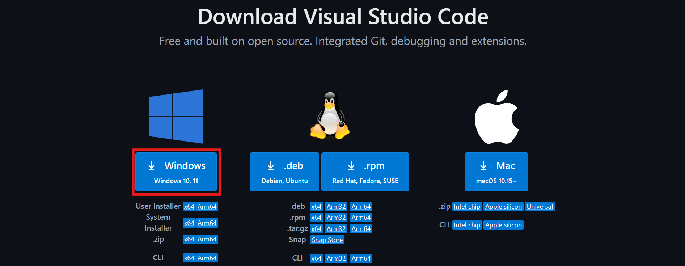
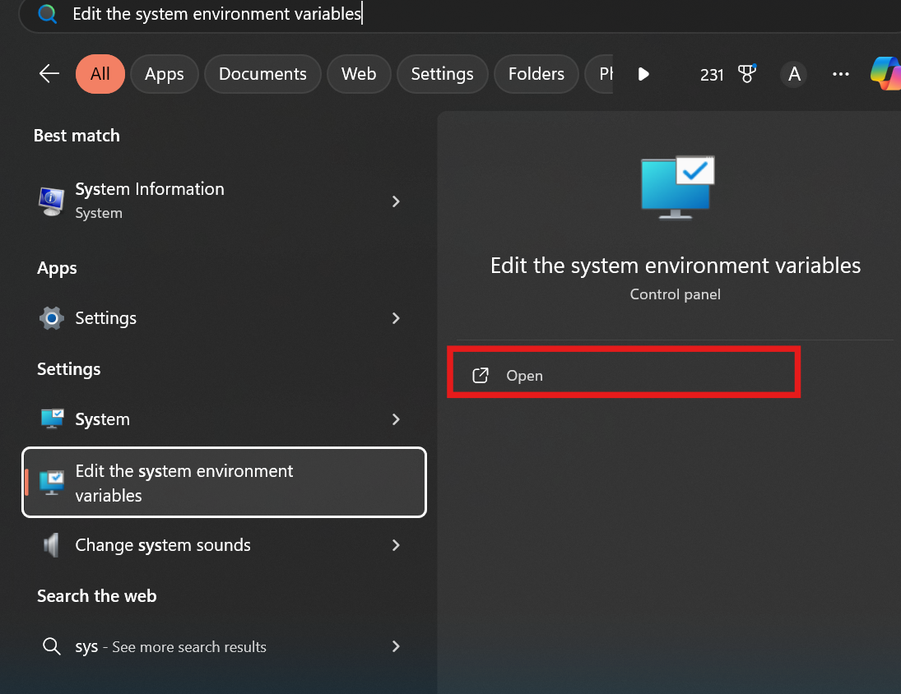
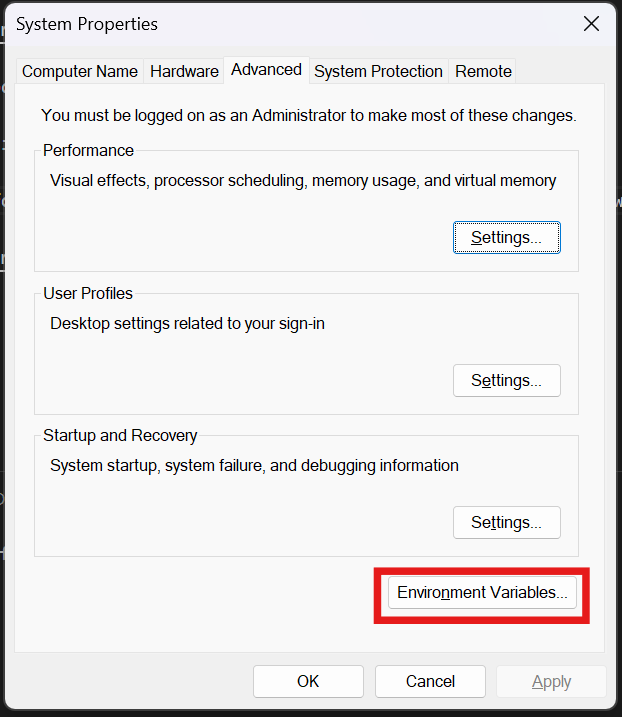
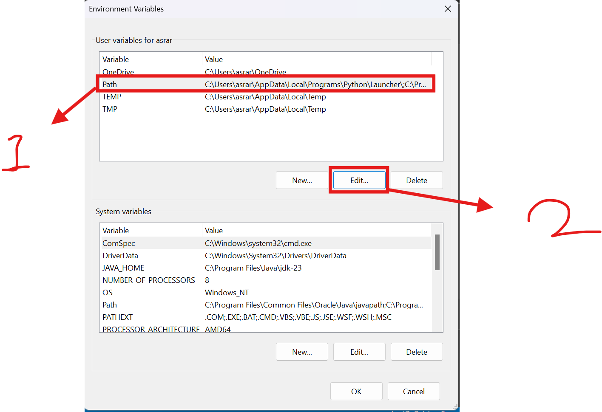
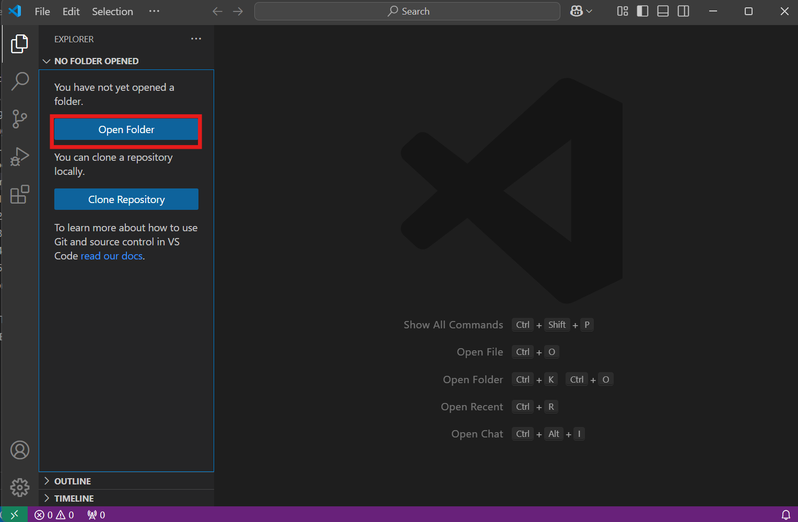
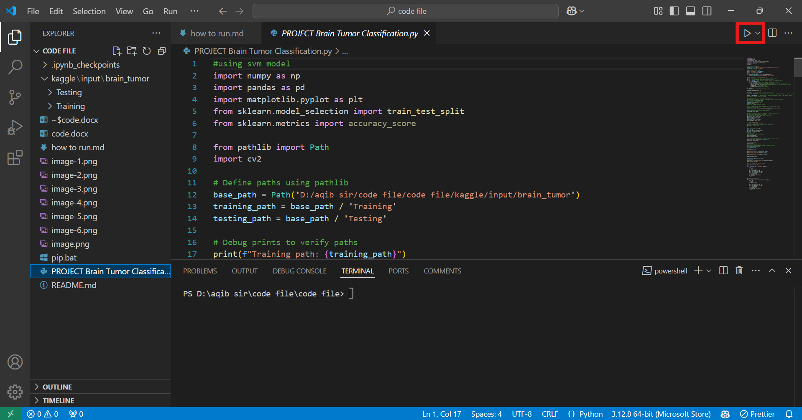

# How to Run This Program

## Prerequisites

1. Install [Visual Studio Code](https://code.visualstudio.com/download)

   

2. Install Python 3.1X (Latest version as of writing this file is 3.13)

3. Set up Python environment variables:
   - Search for "Edit the system environment variables" in the Windows search box.
   - In the file explorer, navigate to:
     ```
     C:\Users\USERNAME\AppData\Local\Packages\PythonSoftwareFoundation.Python.3.1X_XYZ\LocalCache\local-packages\Python31X\Scripts
     ```
   - Copy the address.

   
   
   

4. Restart your PC.

## Running the Program

1. After restarting, run the `pip.bat` file.

2. Restart your PC again.

3. Open Visual Studio Code and select the `Open Folder` option.

   

4. Select the folder where the `pip.bat` file is located.

5. Select the `PROJECT Brain Tumor Classification.py` file.

6. Run the file.(NOTE: PLEASE CHANGE THE FILE DIRECTORY IN `PROJECT Brain Tumor Classification.py` LINE 12)

   

Done!